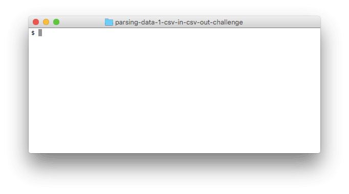

# Parsing Data: CSV to Ruby to CSV

## Summary
In this challenge we'll begin to explore *[persistence][]*, which allows the *state* of our applications—their data—to live on after our applications are done running.  See, as a program runs, Ruby creates objects that exist only in our computer's memory.  And when the application ends, that in-memory data is lost.  To save the state of our applications, we need to store the data somewhere more permanent than the computer's memory.

For this challenge, we're going to use a text file as a data store.  We'll load data from a text file into a Ruby application.  We'll also write data from a Ruby application to a text file.

### Encoding Data as Text
There are a number of other commonly used formats for encoding data as text.  We'll be using [CSV][wikipedia csv] in this challenge.  Other examples are XML, JSON, and YAML.  Encoding data in one of these formats has some advantages.  First, these standard formats make our data easily transferable.  So, for example, our Ruby application can save data formatted as CSV and then a JavaScript application can load that CSV data.  Second, most languages provide libraries for reading and writing these formats.

### Ruby's CSV Library
Ruby provides a `CSV` library which we'll use to read from and write to CSV files (see [Ruby docs][ruby docs csv]).  `CSV` is not automatically loaded when Ruby starts.  We need to explicitly require it (see `person_parser.rb`).

In addition to learning about persistence and transferring data between formats, another goal of this challenge is to learn how to use a new library.  The `CSV` library will be unfamiliar to us.  But, we're going to learn how to use it.  How do we do that?  Reading documentation is a great starting point.  We can also experiment in IRB.  What else?  


## Releases
### Release 0: Build Ruby Objects from CSV Data
We're going to start by building Ruby objects from CSV data.  We'll build a `PersonParser` module.  This module will have the responsibility of parsing the data in a CSV file into `Person` objects.  Every line in the CSV file will be used to create an instance of the `Person` class (see `person.rb`).

Write out the method body for the `PersonParser.parse` method.  This method accepts one argument, the name of a CSV file (see `people.csv`).  It converts each line of data in the file into a `Person` object and returns those objects in an array.  Tests are provided in `spec/person_parser_spec.rb`.

*Note:*  In a CSV file everything is text, so everything comes into Ruby as a string.  Names, phone numbers, and e-mail addresses are represented well as strings.  But, for other data there are more appropriate data types.  For example, in the CSV file the born at date and time is a string formatted `YYYY-MM-DD HH:MM:SS`.  While this string does represent a date and time, Ruby provides classes like [DateTime][] specifically built for representing dates and times.  The tests expect that appropriate data types are chosen.


### Release 1: Working with the Ruby Objects
  
*Figure 1*.  Filtering the ruby objects created from the CSV file.

One of the advantages of loading the data from the CSV file into Ruby objects is that it becomes easier for us to filter the collection of people or to manipulate their attributes.  For example, we could order the people by first name.  Or, we could update a person's phone number.

Read through `runner.rb`. We want our program to allow users to filter people using different commands: filtering people from a specific area code, with a specific last name, with an e-mail address from a specific domain, or born after a given year.  When we're done, the program should operate similar to the example in Figure 1.

Begin by completing the feature for searching for people by area code.  Run the program and follow the error messages (Hint:  we'll be adding to our `Person` class).  Once users can search for people by area code, implement the other three features:  searching by last name, by e-mail domain, and by birth year.  Then think up and add another feature of our own.


### Release 2: Saving Ruby State to CSV
```ruby
jane = Person.new(...)
john = Person.new(...)

PersonWriter.write('friends.csv', [jane, john])
```
*Figure 1*.  Creating people in ruby and saving their data to a CSV file.

We can parse CSV data into Ruby objects which we can use in our programs.  Now we're going to take Ruby objects and save their state to a CSV file.  To do this, we'll build a `PeopleWriter` module with a `.write` method.  We can create a collection of `People` objects and then tell the writer to write them to a file.  (see Figure 1)

We do not need to write tests for the writing behavior.

*Note:* When we read and write to a file, we can choose a mode (like `"r"` for read and `"w"` for write).  The CSV modes are the same as the [modes available for File][ruby file modes].


### Release 3: Collect and Save Information
Now that we can write data to CSV, let's write a script that will allow us to create a CSV address book based on user input.  We'll enter people's names, phone numbers, etc. and then save the data to a CSV file.  Let's modify the runner file so that when it runs, we're prompted to enter information.  We'll enter the data for as many people as we want.  And then, once we're done making entries, the data we've entered will be written to a CSV file.


## Conclusion
The overall goal of this challenge is to learn to manipulate Ruby objects and CSV as part of a single application. All the data we needed to represent people was held in a CSV file, but the CSV file is just text and lacks person-like behavior (e.g., returning a name).  By creating Ruby objects based on the data, we were able to create objects whose behaviors matched the needs of our application. This is a common pattern in software engineering: change the representation of data from Format A to Format B to make it easier to do X with it.

[DateTime]: https://ruby-doc.org/stdlib-2.4.0/libdoc/date/rdoc/DateTime.html
[DateTime.parse]: http://www.ruby-doc.org/stdlib-2.4.0/libdoc/date/rdoc/DateTime.html#method-c-parse
[persistence]: https://en.wikipedia.org/wiki/Persistence_(computer_science)
[ruby docs csv]: http://ruby-doc.org/stdlib-2.4.0/libdoc/csv/rdoc/CSV.html
[ruby file modes]: http://ruby-doc.org/core-2.4.0/IO.html#method-c-new-label-IO+Open+Mode
[wikipedia csv]: https://en.wikipedia.org/wiki/Comma-separated_values
